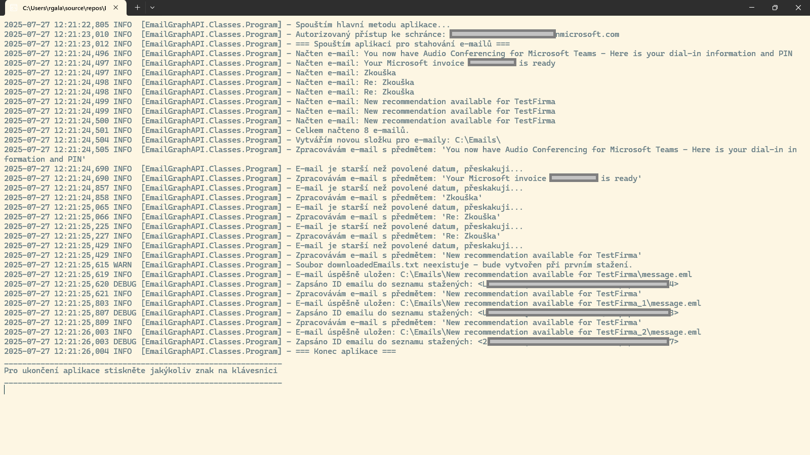

# Email Downloader pomocí Microsoft Graph API

<p float="left">



</p>

Tato konzolová aplikace slouží ke stahování e-mailů z Microsoft 365 pomocí Microsoft Graph API a ukládá je na disk. Aplikace je konfigurována přes soubor `config/config.json`.

## Funkce

- Připojení k e-mailové schránce zadané v konfiguraci (`Mailbox`)
- Stáhne všechny přijaté e-maily od definovaného data (`StartDate`) v pořadí, v jakém byly přijaté, až po nejnovější
- Umožňuje stránkování e-mailů při stahování
- Při dalším spuštění stáhne pouze nové, dosud nestáhnuté e-maily
- Každý e-mail je uložen do složky pojmenované podle jeho předmětu
- Uložený e-mail obsahuje i přílohy
- Logování do konzole a do souboru `logs/myapp.log` pomocí Log4Net
- Přístup pouze k povoleným schránkám (`AllowedMailBoxes`), ostatní jsou odmítnuty a zaznamenány do logu

## Konfigurační soubor

Konfigurace se nachází v souboru: `config/config.json`

Příklad:

```json
{
    "TenantId": "your-tenant-id-here",
    "ClientId": "your-client-id-here",
    "ClientSecret": "your-client-secret-here",
    "Mailbox": "user@example.com",
    "DownloadPath": "C:\\Emails\\",
    "AllowedMailBoxes": [ "user@example.com", "anotheruser@example.com" ],
    "StartDate": "2025-07-22",
    "EmailPageSize": 10
}
